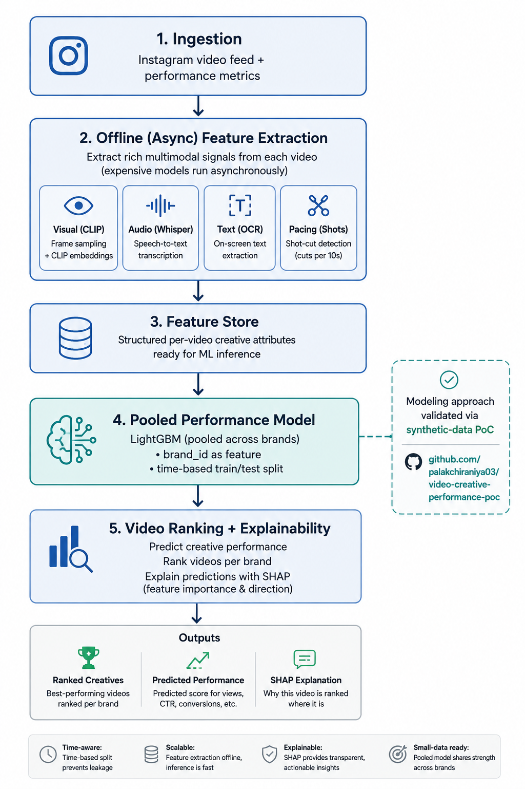
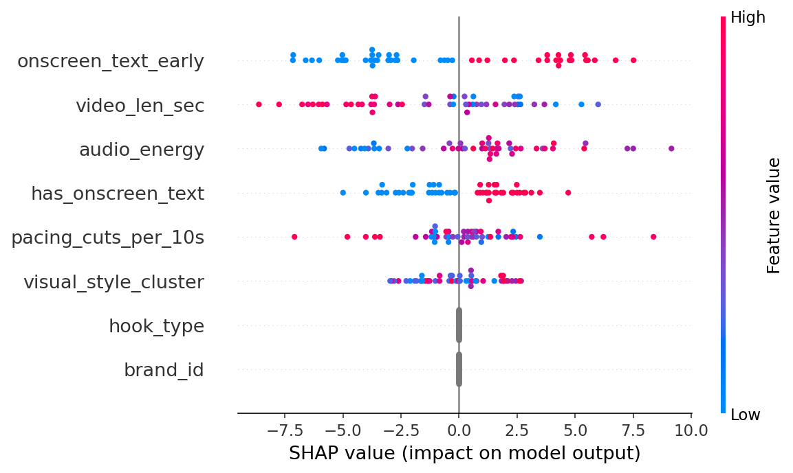
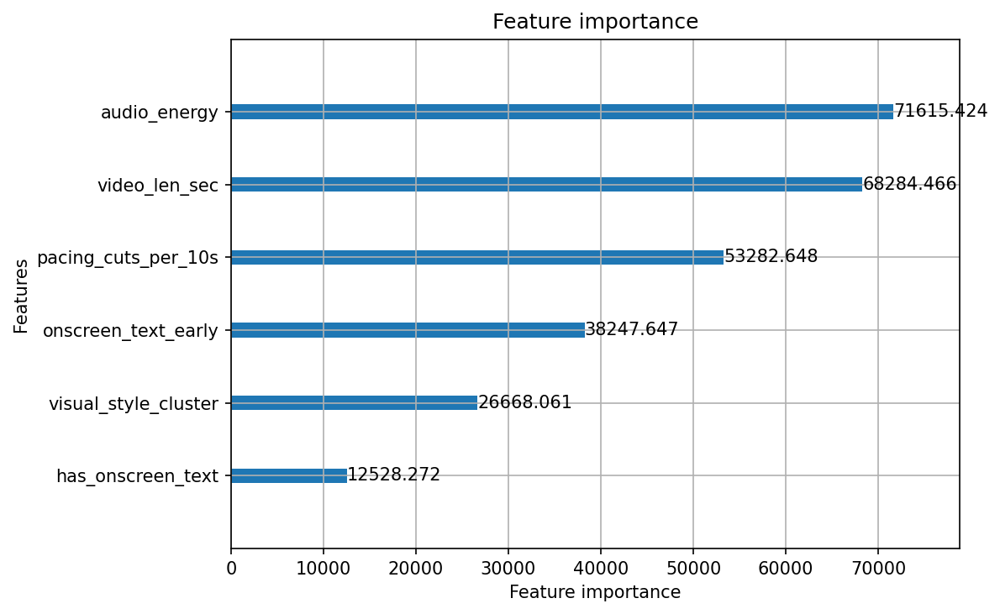

# PoC: Small-Data Creative Performance Modeling with Explainability

## Architecture 



## Tech stack

| Category | Tools |
|---|---|
| Language | Python |
| Modeling | LightGBM |
| Explainability | SHAP |
| Data handling | Pandas, NumPy |
| Evaluation | Scikit-learn, SciPy |
| Visualization | Matplotlib |

This is a scoped proof-of-concept validating the core modeling decision from
my Section 3 answer: predicting + ranking video creative performance per
brand, under a small-per-brand-data constraint, with SHAP-based explanations.

**Scope note:** this does NOT call the Instagram API or process real video —
that's weeks of infrastructure work, out of scope for a same-day take-home.
Instead, `generate_data.py` synthesizes 200 videos (40/brand across 5 brands)
with realistic creative features (hook type, pacing, on-screen text timing,
audio energy, etc.) and a performance score with a known, brand-specific
ground-truth relationship baked in. This isolates and tests the *modeling
approach* — pooled global model + time-based split + SHAP — independent of
the (separately-solved) feature-extraction problem.

## Files
- `generate_data.py` — synthetic dataset generator
- `train_and_explain.py` — trains global LightGBM model (brand_id as feature),
  evaluates with a time-based split, and extracts SHAP explanations
- `synthetic_video_data.csv` — generated dataset

## Results

- **Test MAE: 11.46** (on a 0-100ish performance score scale)
- **Overall Spearman rank correlation: 0.38**
- **Per-brand ranking quality varies significantly**: brand_B rho=0.70,
  brand_E rho=0.54, brand_A rho=0.14, brand_C rho=0.20, brand_D rho=-0.18

## Honest finding: this surfaces a real limitation, not just a demo

The per-brand rank correlation swings from 0.70 to -0.18 across brands with
*identical* sample sizes (n=10 test videos each) — this is a direct,
reproducible demonstration of why the problem statement specifically flags
"small per-brand datasets" as a hard part of the system. It isn't a solved
problem just because you use a global model.

More specifically: `hook_type` and `brand_id` show **~0 SHAP importance** in
this run, despite brand-specific hook preference being explicitly baked into
the synthetic ground truth. With only ~30 training rows per brand, a pooled
tree model with `min_child_samples=5` doesn't reliably find the brand x hook
interaction — it's diluted by higher-volume continuous features like
`onscreen_text_early` and `video_len_sec`.

**What I'd change in a production version, based on this finding:**
1. Explicitly engineer a `hook_matches_brand_historical_preference` interaction
   feature rather than relying on the tree to discover brand x hook_type
   interactions from raw categoricals with this little data.
2. Move from single pooled GBM toward a hierarchical/partial-pooling model
   (e.g., a mixed-effects model or Bayesian hierarchical regression) so brand-
   level effects get explicit shrinkage instead of competing for tree splits.
3. Increase `min_child_samples` regularization search and check whether
   brand_id needs to be passed as a native categorical with higher priority,
   e.g., via monotonic constraints or by training small per-brand residual
   correctors on top of the global model's base prediction.

This is exactly the kind of thing that only shows up when you actually run
the pipeline end-to-end on data instead of just diagramming it on paper —
which is the point of this PoC.

## Model explainability (visualizations)

Running `train_and_explain.py` saves two plots, which make the finding
above directly visible rather than just described in text.

### SHAP summary (beeswarm) plot


Each row is a feature; each dot is one test-set video. Dot position shows how
much that feature pushed the prediction up or down for that video, and color
shows whether the feature's value was high (pink) or low (blue). `hook_type`
and `brand_id` collapse to a flat gray line at zero — visual confirmation
that the model isn't using them at all, consistent with the small-per-brand-
data limitation discussed above.

### LightGBM feature importance (gain-based)


A second, independent importance measure (based on how much each feature
improves split quality across the trees). Notably, `brand_id` and
`hook_type` don't appear on this chart at all — they contributed zero gain,
cross-confirming the SHAP finding via a completely different method.

Together, these plots are why this PoC is useful beyond a demo: they make it
easy to inspect what the model actually learned versus what it was supposed
to learn — exactly the kind of debugging visibility a real production ML
system needs.

## How to run
```bash
pip install lightgbm shap pandas numpy scikit-learn
python3 generate_data.py
python3 train_and_explain.py
```

## Future work

- Instagram Graph API ingestion (replacing the synthetic data generator)
- CLIP embeddings for visual feature extraction
- Whisper transcription for audio/hook detection
- OCR for on-screen text extraction
- Bayesian hierarchical model for better per-brand pooling (see "Honest finding" above)
- Online/incremental learning as new performance data arrives
- Agentic creative recommendation layer (brief generation, budget reallocation, automated experimentation)
